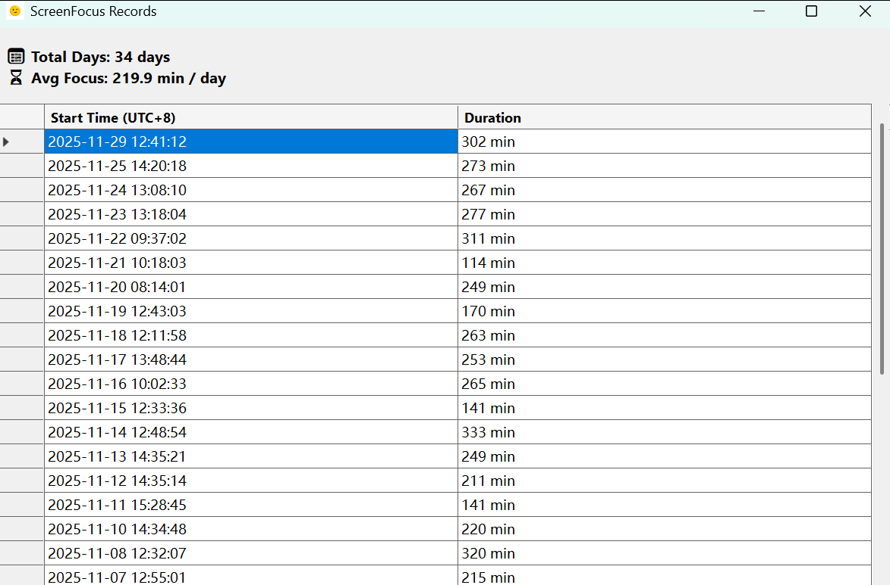

# ScreenFocus

This is a program like Pomodoro Clock which used to record my spent time on computer.

# How to use

Unzip the release and double click the `ScreenFocus.exe` to run. The exe is self-contain on Windows so you don't need .NET environment. Please do not modify anything in the directory and the data store in the `records.json`  

You can double click the tray to open the data window:



Right click the tray and you can see:


- `show homepage` is the same with double click tray.
- `Start` If it is first `Start`, it will open a new session which records a whole time. It will start a random clock and pop up a reminder window after 17-23 minutes. You can choose continuing next clock or just staying in stop status in the window.
- `Stop` will stop current clock. If you use `Start` after `Stop` it will be a new Clock.
- `Clean` will write data which contain the whole time and when you start first clock to the `records.json`. And the session is end here. I use this for accumulating all clocks of one day.
- `Exit` will execute the `Clean` and exit.

*Attention:* only the reminder window pop up, the clock time can be added to whole time. If `Stop` a clock, the time can not be added to the whole time.

# How to build

My dotnet version:
```bash
> dotnet --version
9.0.307
```
Just clone this repository and `dotnet run`.

# Credit

icon: https://icon-icons.com/icon/emo-emoticon-emoji-face-wink/152154

# LICENSE

MIT